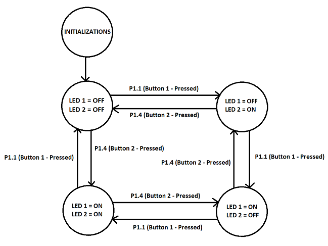

# MSP432_UARTCommunication
## Introduction
The task for this project is to create a simple application on a computer that would be used to communicate with the embedded board via serial port (RS232) over a USB connection. A simple state machine consisting of 4 states is implemented for the application running on the machine to send inputs and get a visual response when the serial port receives that input (LED’s light up). The architecture and code will be described in detail in the following paragraphs below.
## Embedded Processor (main.c)
In the Keil project, the “main.c” file is where all the configurations of the embedded board and logic of the state machine hold. To prevent high cohesion, several functions were developed to handle specific configurations. For instance, functions “configurePort1()” and “configurePort2()” perform bitwise manipulations (setting, clearing and toggling bits) to configure interrupts (button, NVIC and CPU), set buttons P1.1 and P1.4 as inputs using pull-up internal resistors, set up LEDs P1.0 and P2.0 as outputs and initialize both LEDs to state 1 (Both LEDs OFF). In addition, function “configureUART()” configures pins 2 & 3 as UART pins for secondary function, sets the clock to 12 MHz & baud rate to 9600 bps and enables interrupts so when data is moved to the transmit data buffer an interrupt flag will be enabled. In addition, there are four functions called “nextStateButtonAction(int state)”, “previousStateButtonAction(int state)”, “handleState(bool next)” and “configureState(int state)”. These functions are implemented to handle all state machine logic; sets the state to the next or previous state depending on which button is pressed. Lastly, there are two ISRs that have been implemented. Firstly, the “PORT1_IRQHandler()” function is the ISR which handles the interrupt generated by the either P1.1 or P1.4  (with debouncing). Secondly, the “EUSCIA0_IRQHandler()” is the ISR which handles the interrupt generated by the TXIFG when the transmit buffer (TXBUF) receives an “N” for next state or “P” for previous state. Overall, the “main.c” is responsible for configuring and communicating with UART and implementing the state machine.
## Graphical User Interface (UARTCommunication.jar)
The UART communication application is written in Java using the jSerialComm library to access the serial port (over virtual COM ports on Windows). The GUI follows the MVC design pattern. The Java project consists of five classes: "UARTCommunicationModel", "UARTCommunicationEvent", "UARTCommunicationView", "UARTCommunicationFrame" and the "UARTCommunicationController". The UARTCommunicationModel is where library jSerialComm is utilized to open the serial port (COM4) and contains methods to input data (send either “N” or “P”) into the serial port's InputStream and receive output from the serial port's OutputStream. The UARTCommunicationFrame is where all the GUI components are created to provide a simple interface that contains all the necessary information to give the user. The UARTCommunicationController handles what to do when a JButton is being clicked on the GUI. The controller works similarly to how an ISR works when a button triggers an interrupt. The controller is implemented so that when a button is pressed (on the GUI), it tells the UARTCommunicationModel to send the proper inputs to the serial port for the state machine to change states. When an event occurs (output from the serial port) and the GUI needs to be updated, a UARTCommunicationEvent is created in the model to notify the UARTCommunicationFrame and update the GUI, respectively.

State 1 –> LED 1 = OFF & LED 2 = OFF  
State 2 -> LED 1 = OFF & LED 2 = ON  
State 3 -> LED 1 = ON & LED 2 = OFF  
State 4 -> LED 1 = ON & LED 2 = ON  
When button P1.1 is pressed, we transition to the next state.  
When button P1.4 is pressed, we transition to the previous state.  
